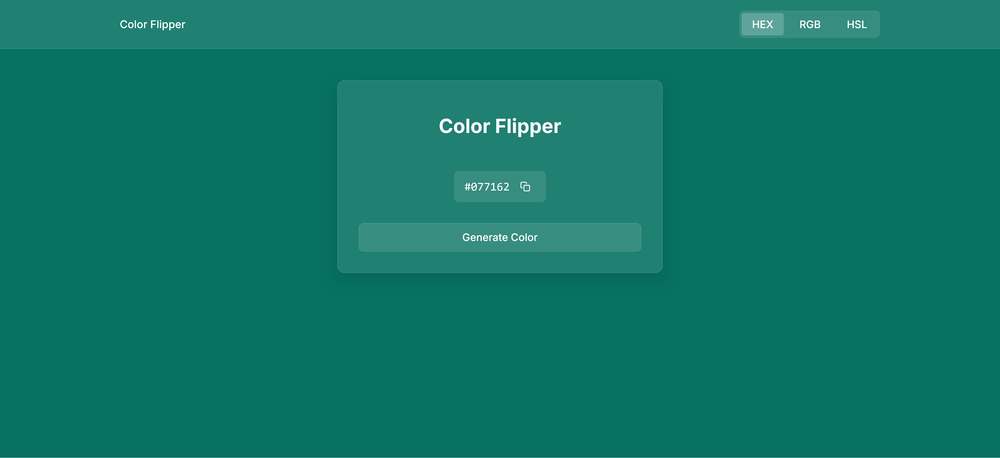
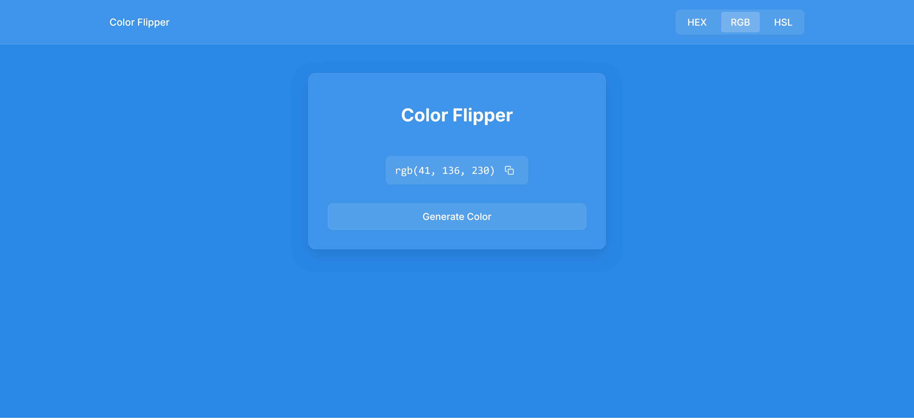
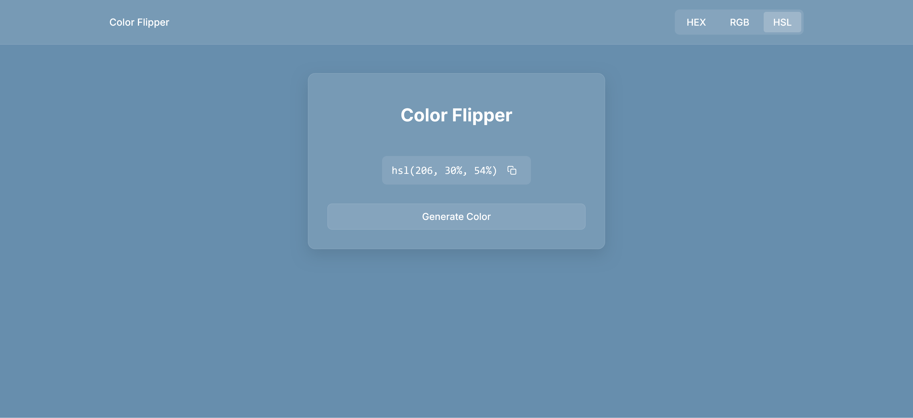

# 🎨 Color Flipper

Welcome to **Color Flipper**! A fun and interactive web app that lets you generate random colors in various formats (HEX, RGB, HSL) and allows you to copy the color code with a single click! 🚀

## 🛠️ Features

- **Generate Random Colors**: Tap a button to generate random colors in **HEX**, **RGB**, or **HSL** formats.
- **Copy Color Code**: Easily copy the generated color code to your clipboard with the click of a button! 📋
- **Toast Notifications**: A pop-up notification confirms when the color code is successfully copied! 🎉
- **Keyboard Accessibility**: Use the **Enter** key to generate new colors or copy the color code. ⌨️

## 💻 Tech Stack

- **HTML**
- **CSS**
- **JavaScript**

## 🔨 Installation

1. Clone the repository:
   ```bash
   git clone https://github.com/your-username/color-flipper.git
   ```
2. Open the project in your preferred text editor.

3. Launch `index.html` in your browser to view the project! 🌐

## 📄 How It Works

- The app initially displays a color code in **HEX** format.
- You can switch between **HEX**, **RGB**, and **HSL** formats by clicking the tabs at the top.
- **Generate Color**: Click the "Generate Color" button to change the background color and show the new color code.
- **Copy Color Code**: Click the copy icon to copy the color code to your clipboard. You’ll see a notification confirming the action!

## 🔑 Accessibility Features

- **Keyboard Accessibility**: You can press the **Enter** key to generate new colors or copy the color code.
- **Aria Labels**: All interactive elements are labeled for screen readers for better accessibility.

## 🖌️ Example

Here is a preview of the app:





## 📅 To Do

- Add more color formats (e.g., CMYK).
- Improve color contrast for better accessibility.
- Fix text color in navbar and card for bright colors.

Thanks for checking out **Color Flipper**! 🎉 Feel free to customize it as you like! 😊
